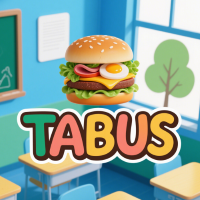

# TABUS

#### 介绍
TABUS:智慧教室，智慧课堂

塔布斯光绽异芒，非凡才略绽光芒 。

一天必须吃两个汉堡不然就退群吧
#### 软件架构

1. 使用FFmpeg处理视频

FFmpeg安装教程：https://blog.csdn.net/Natsuago/article/details/143231558

#### 核心业务流程设计

课程创建→视频分析→数据统计→课程结束

#### 使用说明

购买巨无霸套餐解锁

#### 参与贡献

